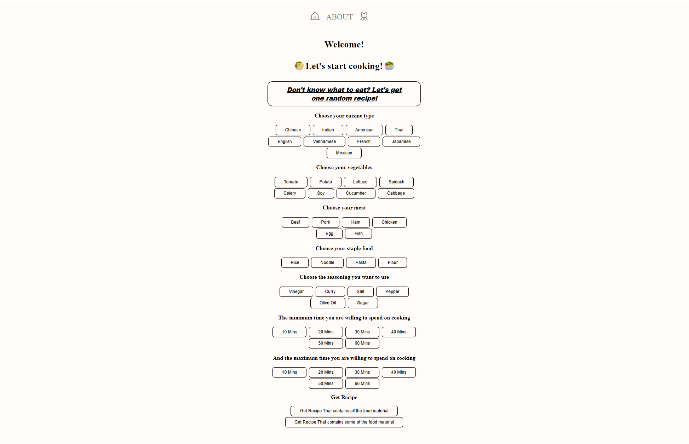
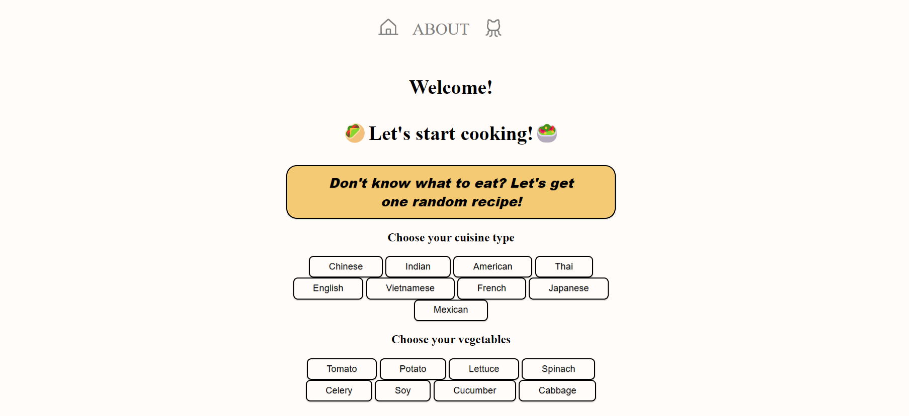

# Let's Cook! - recipe website

> A simple use recipe website created with Node.js, React and MongoDB.

## Table of Contents

- [General info](#general-info)
- [Recipe Data](#recipe-data)
- [Technologies](#technologies-used)
- [Features](#features)
- [Screenshots](#screenshots)
- [Setup](#setup)
- [Usage](#usage)
- [The Project Status](#the-project-status)
- [Room for improvement](#room-for-improvement)

## General info

- I like baking and making different stuff. And I'm new to cooking. I found it time-consuming to find suitable recipe. So I have the idea to make a simple recipe website.
- The website I want to build is the kind of website that would not cost users a great amount of time to search for suitable recipe, and display information in a simple and direct way.
- This project is a recipe website, with React frontend and Node.js and MongoDB backend.

## Recipe Data

In this project we used recipe scraped from [feastingathome](https://www.feastingathome.com/), [bbcgoodfood](https://www.bbcgoodfood.com/) and [allrecipe](https://www.allrecipe.com/).

We get the title, image, instructions, ingredients, label, source and recipe url of the recipe and store them into MongoDB. Python code and sample data can be found on folder /recipe_scraper.

## Technologies Used

Project is created with:

- React - 18.2.0
- Node.js - 16.18.0
- npm - 8.19.2

## Features

Here are the ready features:

- Get a random recipe
- Choose food material, cuisine type, the minimum and maximum time to cook, and get the recipe that meet the requirement

## Screenshots

### Home page

Click on the icon of small house on the top of the page, users can go back to home page.



### About page

Click **ABOUT** on the top middle of the page, users can see the about page.


### Github Repository

Click on the second icon on the top of the page, users can go to the github repository of the website.

## Setup

To run this project, install it locally using npm in folder client and server

### In client folder:

```
$ cd ../client
$ npm install
$ npm start
```

### In server folder:

```
$ cd ../server
$ npm install
$ nodemon index
```

## Usage

### Get Random Recipe

Come to the main page, you would there is a big button in the top and middle of the page saying " ". Click on this button, the button is turned into orange, then webpage will display a random recipe, with total time, cuisine type of the recipe also being displayed. You can scroll down the web page to see the result.


And when you put your mouse on the picture, you can see the ingredients that is needed in the recipe, so that you can decide whether to cook it. If user feels good about this recipe, then click on the picture will lead to the webpage of the recipe. Since most of the recipe website nowadays have detailed instructions, and some of them even have videos, I choose not to display these things in the result page, instead lead the user to the recipe page.


### Get Recipe From Your Choice

Scroll down the page, there are sets of squares in different type, representing the type of cuisine, vegetables, meat, staple food(the food the has most of carbohydrate, which is usually an indispensible part in asian cuisine), and the minimum and maximum willing time to cook. Users can choose whatever they want to use.

<!-- 也许放个gif图会更好-->

Click on the button to choose what you want to cook with, how long you are willing to cook, and after click the button turned orange, indicating that you click successfully. Then click on Get Recipe button, you get several results.


If the maximum time the user choose is smaller than the minmum time the user choose, the error will come out, and the user need to choose other time span.


## Project Status

Currently project is partly complete. We may have update of the feature in the near future.

## Room for Improvement

Room for improvement:

- Exact Search

Currently we are using approximate search, using regex expression in MongoDB. When users give out a set of requirements, the search in MongoDB recipe data will give results that meet some of the requirements users give. And making specific recipe searching which meets all the requirement may be add to future search feature.

- Add kitchen appliance or way of cook into searching option

As for baking, you need to have a oven. So having kitchen appliance available can make the process of searching a recipe much more efficient.

- User Interface with color indicating choosing

Currently the design is that, once the button is clicked, the color will change to orange. But once other buttons on the same page is clicked, the previously clicked button will return to the original color, which may be confusing.

## Acknowledgements

This project is a class project, and thanks my teammate[@zsr601](https://github.com/zsr601/) and my profeser and TA.

The idea of using buttons to search was inspired by [this website](https://cook.yunyoujun.cn/).

Most part of the project was based on [this tutorial](https://medium.com/swlh/how-to-create-your-first-mern-mongodb-express-js-react-js-and-node-js-stack-7e8b20463e66)

For recipe data, we used [recipe_scrapers](https://github.com/hhursev/recipe-scrapers), an open source python package for recipe scraping. This tool is really helpful for us to get recipe data from different recipe website.

Many thanks to people who share programming knowledge and project tutotial, I learn a lot from your share. And many thanks for people who share recipe on Internet, without you I won't be able to make this project.
